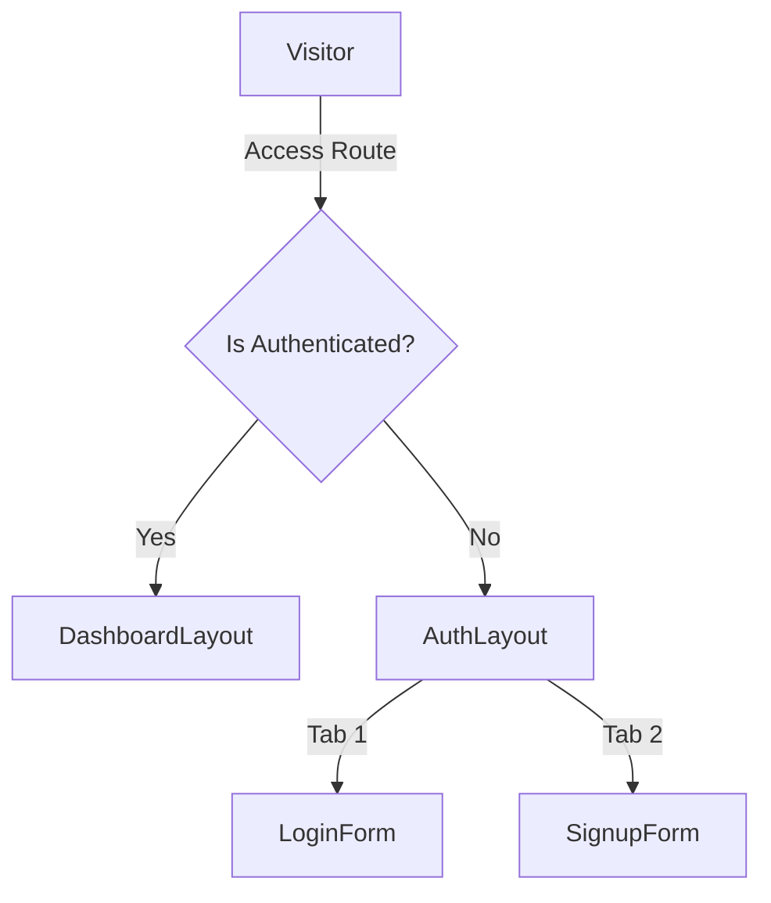

# Frontend Architecture & Authentication Flow Documentation

This document explains the technical implementation of the Authentication and Session Management system under the `/frontend` folder, designed for high security and visual excellence.

---

## 1. Directory Structure

The frontend is structured modularly by features:

```
/frontend
├── index.html                   # Entry HTML template with Google Fonts (Outfit, Inter)
├── package.json                 # Project dependencies & build scripts
├── postcss.config.js            # PostCSS utility preprocessing
├── tailwind.config.js           # Custom theme colors, animations & fonts
├── tsconfig.json                # TypeScript configurations
├── vite.config.ts               # Vite configuration with resolve paths
└── /src
    ├── App.tsx                  # Main router setup, QueryClient, & route guards
    ├── main.tsx                 # App mount entry point
    ├── index.css                # Custom glass scrollbars, inputs, & gradients
    ├── vite-env.d.ts            # Vite client type definitions
    ├── /api
    │   └── axiosClient.ts       # Global Axios client with 401 token refresh queue
    ├── /context
    │   └── AuthContext.tsx      # In-memory access token & active profile cache
    └── /features
        ├── /auth
        │   ├── /components
        │   │   ├── AuthLayout.tsx     # Unified Login/Signup switcher card
        │   │   ├── LoginForm.tsx      # Login form with Zod inline validation
        │   │   ├── SignupForm.tsx     # Signup form with complexity checkers
        │   │   └── SessionModal.tsx   # Live sessions modal with eviction actions
        │   ├── /hooks
        │   │   └── useAuthMutations.ts # React Query mutations & cache updates
        │   ├── /types
        │   │   └── auth.types.ts      # Strict TypeScript API envelopes
        │   └── /validations
        │       └── auth.schema.ts     # Zod schema rules for email & passwords
        └── /dashboard
            └── /components
                └── DashboardLayout.tsx # Main workspaces list & session controls
```

---

## 2. Authentication User Flows

### A. Unified Auth Layout
The authentication screen (`AuthLayout.tsx`) contains a glassmorphic card centering two tabs: **Sign In** and **Register**. Switching between tabs changes the view instantly with fade-in animations.



### B. Inline Zod Validation
Both forms utilize **Zod schemas** (`auth.schema.ts`) to validate inputs before contacting the backend. Field errors trigger immediate red text indicators:
* **Email:** Checked for email structure.
* **Signup Passwords:** Checked for length (6–128 chars), at least 1 uppercase letter, and at least 1 number. Real-time visual bullet lists highlight requirements as you type.
* **Password Confirmation:** Ensures password matches confirm password.

### C. Registration & Behind-the-Scenes Login
1. When a user submits the `SignupForm`:
   * The `useSignupMutation` triggers `POST /api/v1/auth/signup` to register the record.
   * Since the backend registration endpoint does not set credentials, the mutation **automatically calls the login endpoint** (`POST /api/v1/auth/login`) behind the scenes using the provided email and password.
   * On successful login, the returned `accessToken` is stored in-memory, the active user profile is populated, and they are seamlessly redirected to the `/dashboard`.

---

## 3. Session Management Flow (Modal)

The session management console (`SessionModal.tsx`) acts as the security dashboard, accessible from the upper-right corner of the dashboard.

```
+--------------------------------------------------------------+
| Active Sessions                                          [X] |
| Review and manage devices signed into your account.          |
+--------------------------------------------------------------+
| [Laptop Icon] Chrome on Windows               [Current Badg] |
|   IP: 192.168.1.1                                            |
|   Started: Jul 17, 2026 at 13:00                  [Trash Bin]|
+--------------------------------------------------------------+
| [Phone Icon] Mobile Safari on iOS                            |
|   IP: 104.28.1.12                                            |
|   Started: Jul 16, 2026 at 09:15                  [Trash Bin]|
+--------------------------------------------------------------+
| Log out from all other devices                  [Close Btn]  |
+--------------------------------------------------------------+
```

### A. Rendering Properties
* **Device Icons:** Automatically displays Laptop, Smartphone, or Monitor symbols based on user-agent attributes (`device`, `os`, `browser`).
* **Creation Timestamp:** Formatted dynamically to a clean string, e.g., `Jul 17, 2026 at 01:00 PM`.
* **Current Session Badge:** Tagged next to the device matching the active session ID, styling it with a subtle purple glow.
* **Termination Actions:** Dedicated eviction buttons next to each session. If clicked:
  * Evicting a *secondary session* terminates that hardware's tokens.
  * Evicting the *current session* immediately logs the client out locally, invalidates all cached values, and redirects the browser back to `/login`.

### B. Optimistic Updates & Rollbacks
To prevent slow network lag from delaying user action feedback:
1. When the trash icon is clicked, the mutation (`useLogoutSessionMutation`) immediately:
   * **Cancels** active query refetches.
   * **Snapshots** current sessions in the query cache.
   * **Optimistically removes** the terminated session from the UI immediately.
2. If the API request **succeeds**, the query cache is invalidated to pull down the definitive session list.
3. If the API request **fails**, the mutation catches the error, pops up a warning toast at the top of the modal detailing the API error, and **rolls back** the session card instantly using the snapshot context.

---

## 4. Token Expiration & Refresh Queueing

To maximize security, access tokens are never kept in `localStorage`. They reside strictly in-memory.
The client handles token expiration automatically via interceptors inside `axiosClient.ts`:

```mermaid
sequenceDiagram
    autonumber
    Client Request->>Axios Client: Request with Authorization: Bearer <Access>
    Axios Client->>Backend API: Send Request
    Backend API-->>Axios Client: Return 401 Unauthorized (Expired Access Token)
    
    rect rgb(20, 20, 35)
        Note over Axios Client: IsRefreshing flag set to true
        Axios Client->>Backend API: POST /auth/refresh-token (Cookie sent)
        Note over Axios Client: Queue subsequent incoming API calls
    end
    
    alt Refresh Success
        Backend API-->>Axios Client: Return 200 + { accessToken } (Updates cookie)
        Note over Axios Client: Update in-memory accessToken
        Note over Axios Client: Resolve all queued requests with new token
        Axios Client->>Backend API: Retry original request & return result
    else Refresh Fail (Revoked / Expired)
        Backend API-->>Axios Client: Return 401 / 403
        Note over Axios Client: Reject all queued requests
        Note over Axios Client: Wipe in-memory token
        Note over Axios Client: Fire "auth:unauthorized" event -> Log out client & route to /login
    end
```



### Request Interceptor
Attaches the in-memory `Authorization: Bearer <Token>` header to every outgoing request.

### Response Interceptor (401 Interception)
1. Detects `401 Unauthorized` responses.
2. Bypasses interception for `/auth/login`, `/auth/signup`, and `/auth/refresh-token` to avoid infinite loops.
3. If `isRefreshing` is true, return a new Promise, pushing its resolve/reject functions into `failedQueue`.
4. If `isRefreshing` is false, lock requests, and call `POST /auth/refresh-token` (sending the browser's HTTP-only `refreshToken` cookie).
5. On success: Update the in-memory token, resolve the entire queue, and retry the original request.
6. On error: Reject the queue, clear in-memory state, and trigger `auth:unauthorized` to gracefully eject the user.
